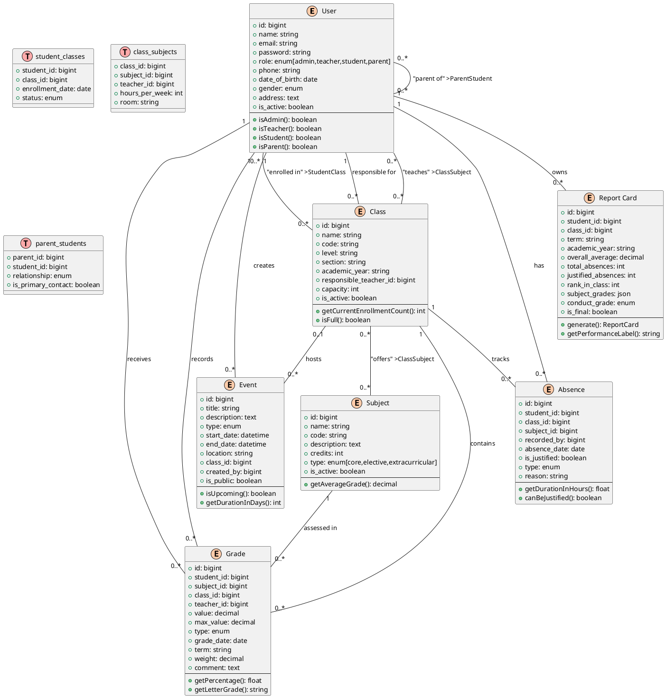
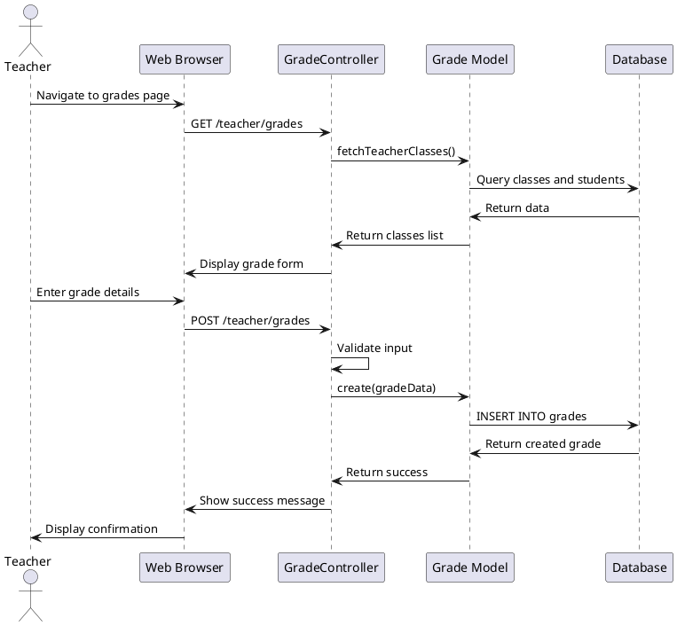
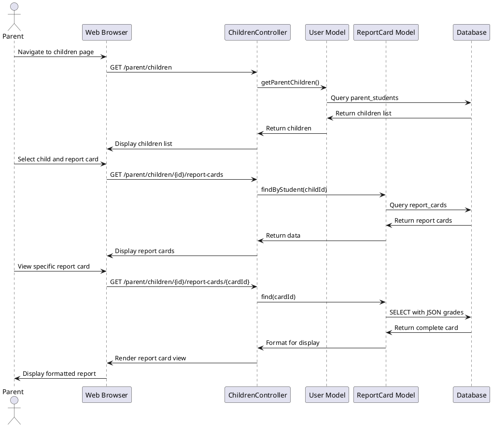
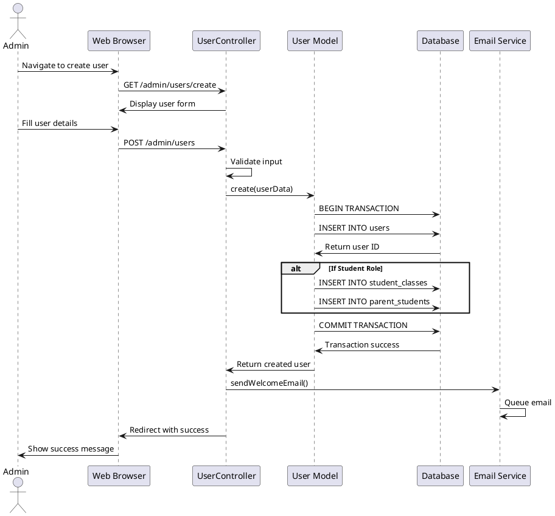
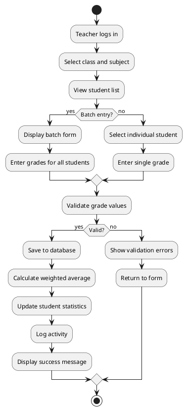
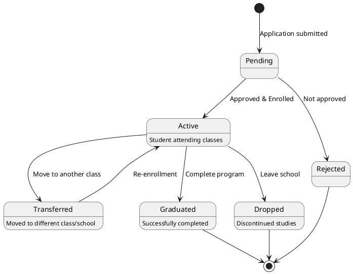
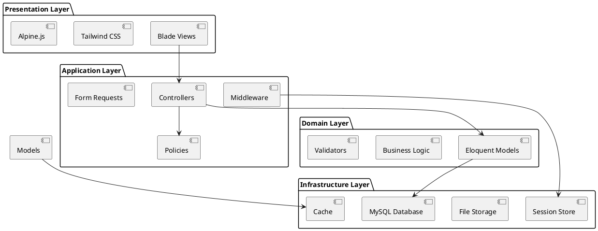

# UML Documentation - School Record Manager

## Domain Model Overview

The School Record Manager system is designed using a robust domain model that represents the key entities and relationships in a school environment. The model has been enhanced from the initial requirements to provide better scalability, maintainability, and data integrity.

## Key Improvements Made

1. **Single Table Inheritance for Users**: Instead of separate tables for each user type, we use a single `users` table with a `role` field. This simplifies authentication and user management while maintaining role-specific behaviors through model methods.

2. **Junction Tables for Many-to-Many Relationships**: Properly implemented junction tables for complex relationships (student-class enrollment, parent-child relationships, class-subject-teacher assignments).

3. **Soft Deletes**: Added soft delete capability to users to maintain data integrity and historical records.

4. **JSON Fields for Flexible Data**: Used JSON field for storing subject grades in report cards, allowing flexible grade structures.

5. **Enhanced Absence Tracking**: Added detailed absence types and justification mechanisms.

## Class Diagram

## Sequence Diagrams

### Use Case 1: Teacher Records a Grade

### Use Case 2: Parent Views Child's Report Card

### Use Case 3: Admin Creates New User

## Activity Diagram: Grade Recording Process

## State Diagram: Student Enrollment Status

## Component Diagram

## Design Decisions and Justifications

### 1. Role-Based Access Control (RBAC)
We implemented a simple but effective RBAC system using middleware and model methods. Each user has a single role, and access to features is controlled at the route level using custom middleware.

### 2. Grade Calculation System
Grades support different types (exam, quiz, assignment) with configurable weights. This allows teachers flexibility in how they structure their assessments while maintaining consistency in calculations.

### 3. Report Card Generation
Report cards are generated dynamically based on current grades but can be "finalized" to create permanent records. The JSON field for subject grades allows flexible storage of varying subject structures.

### 4. Event Management
Events can be school-wide or class-specific, with different visibility levels. The color field allows visual differentiation in calendar views.

### 5. Soft Deletes
Users can be soft-deleted to maintain referential integrity in historical records while removing access. This is critical for maintaining accurate academic records even after users leave the system.

## Future Enhancements

1. **Notification System**: Add real-time notifications for grades, absences, and events
2. **File Attachments**: Allow document uploads for absence justifications and assignments
3. **Advanced Analytics**: Implement predictive analytics for student performance
4. **Mobile API**: Expose RESTful APIs for mobile application development
5. **Multi-language Support**: Internationalization for different languages
6. **Audit Logging**: Comprehensive activity logging for compliance
